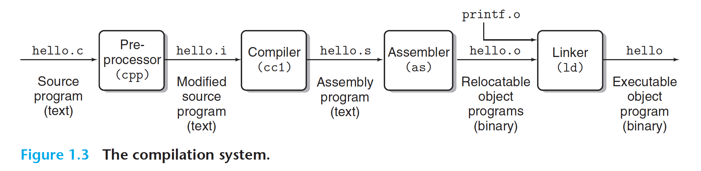
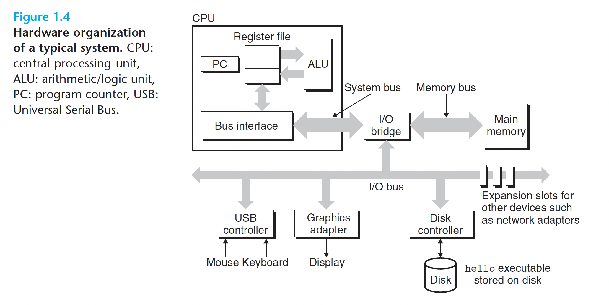
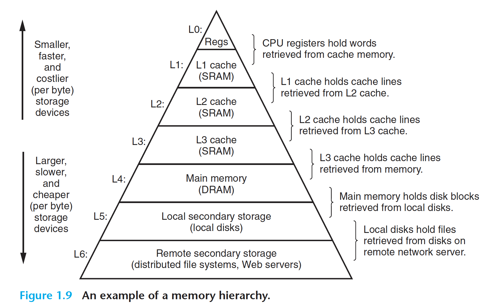
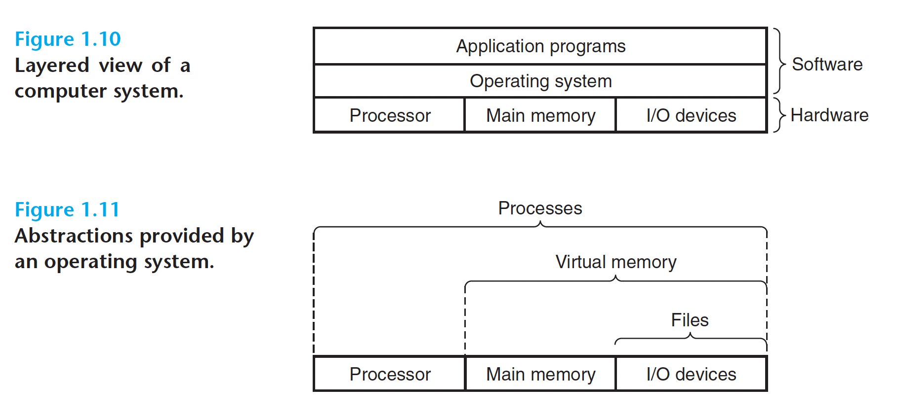
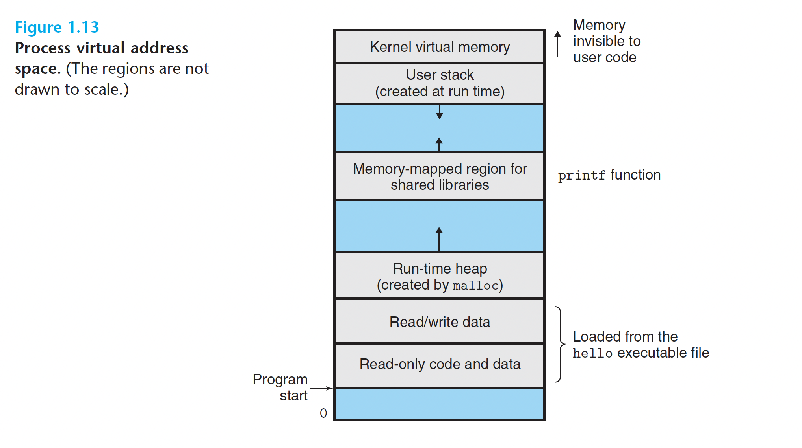
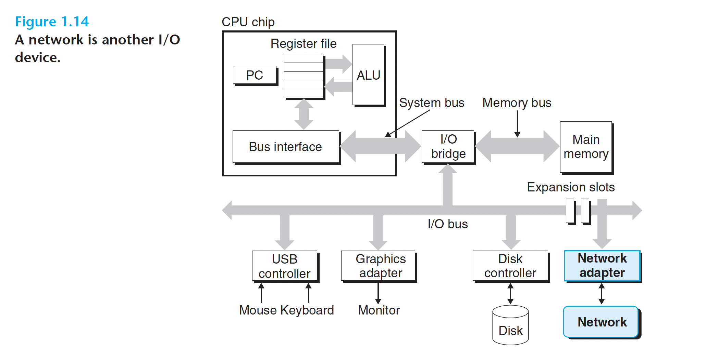
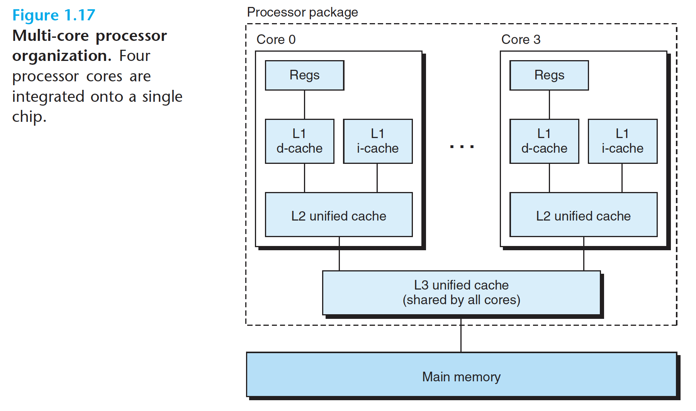

## 一些唠叨

### 为什么会有这个系列？

**扎实的基础和含金的经历一直是找工作的利器**，但在今年却成为了拿到心仪工作门票的必需品。作为浩大转码人群的一员，也是运气稍差，一方面没有专业课的浅薄记忆，另一方面经历上匹配度低，在hc骤减的寒冬里，没有幸存

我记得在pp实习的时候mentor对我说其实不管让谁来做，时间给他，基本都能做个七七八八，没有太大区别。重要的是你的其他方面软实力，决定你到底会走多远。比如你对整个系统、业务线的认知，比如你的沟通能力、在团队中的核心作用

**现实的残酷在于能完成企业任务的人太多了**，而且企业也不指望应届生有啥认知。必须从里面挑出top人选，即使他top的指标对工作内容影响不大。**JD里的各种prefer结果实质上都成了must**。一个亲身经历的点就是**prefer计算机出身**，你学没学过计算机组成？你知道编译的步骤吗？一堆基础且无用的问题扔到你脸上就能验真。

那么扎实的基础到底是个什么？有什么用？面试官为啥普遍看不起没学过计算机基础的竞争者？为了给自己解答这些问题，于是有了这个系列的笔记

cs系列笔记详尽探索计算机专业课，从CSAPP（深入理解计算机系统）出发，逐个击破

### 如何完成笔记？

> 深入浅出

深入：

1. 听**视频课**
2. 浏览视频课件
3. 阅读讲义**书籍**
4. 完成**lab**练习

浅出：

1. 写一份**简明扼要的笔记**（基于[已有的笔记](https://github.com/Sixzeroo/CSAPP)和[博客](https://zhuanlan.zhihu.com/p/103969274)，增量完成，基础任务强调不造轮子）
2. 只写**必要的lab代码**，节省时间，结果上传到github
3. 同步笔记到github仓库、掘金、medium、csdn、知乎、腾讯云等平台中的至少一个

## 信息就是位+上下文
整个计算机系统中的所有信息都可以用一串比特串的形式表示，区分不同的数据对象的唯一方法就是我们读到的这些对象时的上下文（context）

## 程序被其他程序翻译成不同的格式
一个高级语言写的程序（这里以C语言为例），从源代码到最终的机器中的可执行文件会经过一下几个阶段：

```shell
gcc -o hello hello.c
```



1. 预处理阶段，处理源码的中的预处理语句（比如说#include）
2. 编译阶段，将c语言编译成汇编语言
3. 汇编阶段，把汇编语言翻译成机器指令
4. 链接阶段，把在程序中调用的库函数的相关文件引入

## 了解编译系统如何工作大有益处
促使程序员要知道编译系统是如何工作的原因：
1. 优化程序性能，我们需要对汇编语言以及编译器如何将不同的C语句转化为汇编语言有基本的了解
2. 理解链接时出现的错误
3. 避免安全漏洞，其中一个比较典型的是缓冲区溢出错误

## 处理器读并解释存储在存储器中的指令

一个计算机系统的硬件主要由以下几个部分组成：
1. 总线，负责携带信息字节并在各个部件之间进行传输
2. I/O设备，负责系统和外界的联系
3. 主存，运行程序时存放程序以及程序中含有的数据
4. 处理器，解释（或执行）存储在主存中的指令

执行一个hello程序的过程有一下几步：
* shell程序执行其指令，等待我们输入命令
* 我们输入完命令以后，shell执行一系列指令，将hello程序的代码以及其数据加载到主存中
* 处理器开始执行hello程序中的机器指令，将“hello world”输出到屏幕上

## 高速缓存

我们使用的存储设备通常是较大的存储设备比较小的存储设备运行地要慢，所以就使用一个较小的速度较快的存储设备作为CPU和Main Memory交换数据的桥梁，这个设备就是高速缓存（cache memories）

## 形成层次结构的存储结构

在计算机系统的存储设备被组织成了一个金字塔形的存储层次模型，其中从上到下，设备速度越来越慢，空间越来越大，每字节的造价越来越便宜。



## 操作系统管理硬件

操作系统可以看成是一个应用程序和硬件之间的一个软件，其有两个基本功能： 防止硬件被失控的程序滥用； 为应用程序提供控制硬件的简单一致的方法



###  进程
进程可以看成是操作系统对正在运行的程序的一种抽象，在一个系统中可以运行多个进程，这些进程对外表现好像是独占硬件，实际上是通过不同进程之间进程的交互执行实现的，这个过程叫上下文切换（context switch）

###  线程
一个进程可以由多个线程组成，运行在一个上下文环境中，共享代码以及全局数据。因为共享数据，使得其比一般的进程更加高效（花在context switch的时间少）。

### 虚拟存储器
给进程提供的一个好像自己独占主存的假象，对于进程的所使用的虚拟存储器可以分成一下几个部分：
* 程序代码和数据
* 堆，可以动态扩展或者收缩，供像malloc和free这样的C语言中的库进行调用
* 共享库
* 栈，可以动态扩展或者收缩，用于编译器的函数调用
* 内核虚拟存储器



### 文件
文件可以看成字节序列，每一个I/O设备从本质上来看都可以看成是文件

## 利用网络系统和其他系统进行通信

从一个单独的系统来看，网络可以看成一个I/O设备，当系统从主存复制一串字节到**网络适配器**时，计算机就会自动将其发送到另一台机器。



## 并发与并行

**并发（Concurrency）**指一个同时具有多个活动的系统。**并行（Paralleism）**指的是用并发来时一个系统运行得更快。并行可以在计算机系统的多个抽象层次上运用。

### 线程级并发

通过线程之间的并发，可以在一个进程中执行多个控制流。多处理器系统主要分成超线程和多核处理器。超线程技术就可以让一个核同时运行两个线程。多核处理器就是将多个CPU集成到一个集成电路中，然后使用一个L3高速缓存来在多个核之间共享数据。

### 指令级并行

一个指令的执行过程通常包含：取指令阶段、解码阶段和执行指令阶段。

最初的指令执行过程是每个指令完整经过一整个过程后，才运行下一条指令，但是其实每个阶段使用的都是处理器中不同的硬件部分，这就使得我们可以流水线式地运行多个指令，这就达到了差不多一个时钟周期运行一条指令的地步。

即使有流水线设计，在指令执行阶段，处理器还有些区域还是可能会空闲，比如执行一个“从内存取值”指令期间，ALU就会空闲，所以一次性处理多条指令（取值+解码）会更好，如果多条指令要ALU的不同部分，就多条同时执行。


### 单指令、多数据并行

很多现代处理器拥有特殊的硬件，允许一条指令产生多个可以并行执行的操作，这种方式称为单指令、多数据，即**SIMD并行**。

## Amdahl定律

Amdahl定律对提升系统某一部分性能所带来的的效果进行量化。它的**主要思想**是**：**当我们对系统某部分加速时，其对系统整体性能的影响取决于该部分的**重要性**和**加速程度**。

该定律提供的一个**主要观点**是**：**要想显著加速整个系统，必须提升全系统中相当大的部分的速度。


